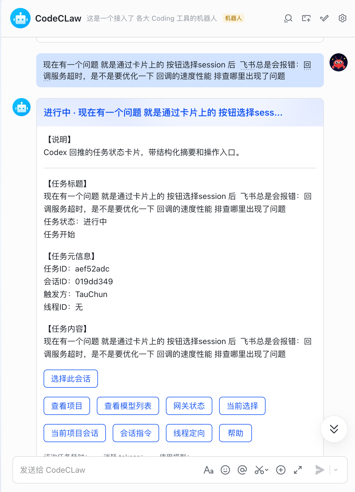
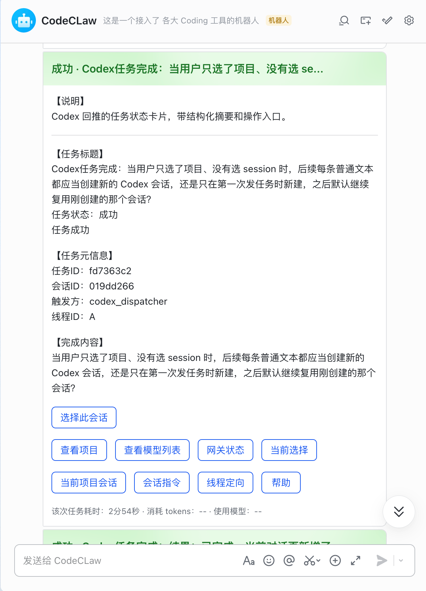

# 灵犀桥（Lingxi Bridge）

灵犀桥是一个用于连接 `Codex / Claude（未来支持其他 vibe coding 工具）` 与飞书、QQ（未来支持其他机器人）机器人的双向智能网关服务。

## 作者信息

- 作者：Albert\_Luo
- 邮箱：<480199976@qq.com>
- 更新日期：2026-04-30

## 当前进度

- 已完成 `Task 1`：Fastify + TypeScript 服务骨架
- 已完成 `Task 2`：SQLite 初始化与基础仓储层

## 发布记录（npm）

维护规则：

- 每次执行 `npm publish` 成功后，会自动触发 `postpublish -> npm run release:update-readme` 更新本表。
- 发布时间以 npm registry 实际时间为准（脚本自动执行 `npm view @tauchun/viblect time --json` 查询）。
- 发布说明自动取当前 Git 提交日志（`git log -1`），并优先写入 GitHub 提交链接，确保发布记录可追溯。

| 版本    | 发布时间（UTC）                | 说明           |
| ----- | ------------------------ | ------------ |
| 0.1.11 | 2026-05-01T15:32:50.263Z | [7d5b151](https://github.com/kokotao/vible-coding-tool/commit/7d5b1517c09def9af0209fcf1696e51f22d546c9) feat: 落地发布加固阶段B并修复运行时验证稳定性 |
| 0.1.10 | 2026-04-30T10:34:41.957Z | [85880d9](https://github.com/kokotao/vible-coding-tool/commit/85880d9071e6db55b45dd27ffaf190cfddf9c7a0) feat: update dashboard, feishu integration, and branding assets |
| 0.1.9 | 2026-04-30T10:22:05.665Z | [85880d9](https://github.com/kokotao/vible-coding-tool/commit/85880d9071e6db55b45dd27ffaf190cfddf9c7a0) feat: update dashboard, feishu integration, and branding assets |
| 0.1.8 | 2026-04-30T10:08:31.861Z | Codex watcher 最近 open_id 回退与发布记录补齐 |
| 0.1.7 | 2026-04-30T09:54:29.147Z | 仪表盘升级、飞书联调、品牌资源补齐 |
| 0.1.6 | 2026-04-29T04:20:06.072Z | 飞书 Codex 流程和发布记录整理 |
| 0.1.5 | 2026-04-28T15:49:55.539Z | CLI 与网关稳定性改进 |
| 0.1.4 | 2026-04-28T15:38:47.342Z | 发版链路修复       |
| 0.1.3 | 2026-04-28T15:00:14.377Z | 打包内容调整       |
| 0.1.2 | 2026-04-28T14:58:03.787Z | 功能迭代发布       |
| 0.1.1 | 2026-04-28T05:38:37.951Z | 初始能力增强       |
| 0.1.0 | 2026-04-28T02:24:46.846Z | 首次发布         |

## 3 分钟快速安装（L0/L1/L2/L3）

完整安装方案见：[项目安装流程设计（V1）](docs/plan/20260428083200407_项目安装流程设计.md)

- `L0 基础依赖层（必做）`：执行 `npm run install:check`（自动按系统选择安装脚本）
- `L1 网关运行层（必做）`：执行 `npm run dev`，访问 `http://127.0.0.1:3000/health`
- `L2 飞书接入层（按需）`：在飞书后台启用长连接并订阅 `im.message.receive_v1`，执行 `npm run feishu:ws`
- `L3 Codex 回推层（按需）`：执行 `npm run codex:run -- --session <session> --title "<title>" -- <你的命令>` 或 `npm run codex:watch -- --session <session> --recipientOpenId <open_id>`

## 全局安装

安装后可直接执行短命令：`vct`

```bash
npm install -g @tauchun/viblect
vct
```

本地仓库试用全局命令（不发布 npm）：

```bash
npm link
vct
```

说明：

- npm 包名与 scope 必须全小写，`@Tau/vibleCt` 这种包含大写的写法会被 npm 拒绝
- 全局命令入口由 `package.json -> bin` 提供（当前支持 `vct`、`viblect`、`vible-gateway`）
- 发布时会通过 `prepack` 自动构建 `dist`，确保全局 CLI 可运行
- 发布时会执行 `prepublishOnly -> npm run publish:check`，自动拦截 `.env`、`data/`、`docs/`、`tests/` 等非发布文件进入 npm 包
- Windows/macOS/Linux 都可使用该命令（前提：Node.js 和 npm 在 PATH 中）

## 本地运行

1. `cp .env.example .env`
2. `npm install`
3. `npm run dev`
4. 打开 `http://127.0.0.1:3000/health`

开发期热重载（可选）：

1. `npm run dev:watch`（会监听文件变化；在 watch 终端按回车会触发重启）

## 一键安装与健康检查

跨平台统一命令（推荐）：

```bash
npm run install:check
```

系统专用命令：

```bash
# macOS / Linux
bash scripts/install.sh
```

```powershell
# Windows PowerShell
powershell -NoProfile -ExecutionPolicy Bypass -File .\scripts\install.ps1
```

```bat
:: Windows CMD
scripts\install.cmd
```

```powershell
# Windows npm 脚本
npm run install:check:win
```

说明：

- 自动补齐 `.env`（若不存在）
- 自动执行 `npm install`
- 自动启动临时 `dev` 进程并探活 `/health`
- 验证完成后自动结束临时进程（如服务已在运行则直接复用）

环境变量加载说明：

- `npm run dev` / `npm run dev:watch` 都会自动加载当前目录下的 `.env.local`、`.env`（按此顺序）
- 已存在的系统环境变量优先级更高，不会被 `.env` 覆盖
- 默认采用“终端精简 + 文件落盘”日志策略，日志按天写入 `LOG_DIR/gateway-YYYY-MM-DD.log`（默认目录 `./logs`）
- 自动清理超过 `LOG_RETENTION_DAYS` 的历史日志（默认保留 7 天）

## 飞书长连接模式（无需公网 webhook）

1. 先启动网关：`npm run dev`
2. 在飞书后台选择“使用长连接接收事件”，并订阅 `im.message.receive_v1`
3. 启动桥接器：`npm run feishu:ws`
4. 在飞书后台点击“重新验证”

说明：

- 桥接器优先读取环境变量 `FEISHU_APP_ID` / `FEISHU_APP_SECRET`
- 若未设置，则自动读取网关中的 `/api/connectors/feishu/config`
- 可通过 `GATEWAY_URL` 指定网关地址，默认 `http://127.0.0.1:3000`
- 若网关配置了 `FEISHU_VERIFY_TOKEN`，请在启动桥接器时同时提供相同值

## QQ 机器人补充（Webhook / WebSocket / Markdown / 按钮）

### 1) 事件模式

- `webhook`：需要在 QQ 开放平台配置回调地址（公网可达）。
- `websocket`：不需要公网回调，推荐本地开发和内网环境使用。

启动方式：

```bash
# 独立启动 QQ WS 桥接
npm run qq:ws
```

可选自动启动（跟随网关）：

```bash
# .env
QQ_WS_AUTO_START=true
```

### 2) 当前消息能力

- 任务状态通知：普通文本消息（`msg_type=0`）
- 指令引导 / 快捷入口：Markdown 消息 + Inline Keyboard 按钮（`msg_type=2`）
- 按钮回调：支持 `INTERACTION_CREATE`，并自动 ACK，避免按钮一直 loading

### 3) QQ 快捷词（与飞书语义对齐）

- `指令帮助` / `帮助` / `help`
- `查看项目`
- `选择项目`
- `查看session` / `查看会话`
- `新建session` / `新建会话`
- `查看模型列表`
- `查看网关状态`
- `当前选择`

说明：

- 对上述“面板类快捷词”，QQ 端会优先返回 Markdown 引导（而不是直接创建任务）。
- 真正执行任务建议使用固定格式：
  - `#session:<会话ID> <任务内容>`
  - `线程 ID：<线程ID>，任务内容：<任务内容>`

### 4) 按钮回调 `button_data` 建议格式

推荐结构化 JSON，便于后续扩展：

```json
{"action":"dispatch","sessionId":"qq-demo","prompt":"修复登录接口500并补单测"}
```

也兼容直接文本命令（例如 `#session:qq-demo 修复xx`）。

### 5) 常见问题

- 看不到按钮消息：
  - 先确认网关版本已包含 QQ Markdown/按钮能力
  - 发送 `指令帮助` 或 `选择项目` 验证是否回 `msg_type=2`
  - 若仍无按钮，检查 QQ 平台侧按钮能力是否开通/审核通过
- 点按钮后一直 loading：
  - 检查日志是否出现 `PUT /interactions/{id}` 回执成功

## Codex 任务自动回推（执行即上报）

当你希望“任务执行完自动推送到飞书”时，使用 `codex:run` 包装执行命令：

```bash
npm run codex:run -- --session feishu-codex-demo --title "修复登录接口" -- npm run test
```

说明：

- 该命令会自动上报 `running` -> `succeeded/failed` 到 `/api/codex/events`
- 默认会尝试复用该 `session` 下最新 `running` 任务（由飞书 `#session` 指令创建）
- 可通过 `--task <taskId>` 指定任务
- 可通过 `--gateway <url>` 指定网关地址
- 若配置了 ingress 安全，可用环境变量：
  - `CODEX_INGRESS_TOKEN`
  - `CODEX_INGRESS_SIGNING_SECRET`

## 仅用机器人自然语言的高阶用法（全部交给 Codex 执行）

下面这套方式不需要你发 `#session`、`线程 ID`、`查看项目`、`选择项目` 这类交互指令。\
你只发自然语言任务，让 Codex 自己在工作区里完成“识别项目、切换目录、执行命令、回报结果”。

### 1) 自然语言切换项目并继续开发

你可以直接对机器人说：

- `切换到 D:\\WorkSpace\\AlbertLuo\\vible-coding-tool 项目，先读 AGENTS.md，然后继续修复 QQ 交互按钮问题。`
- `在当前工作区里列出所有项目，进入 my-docker-project，执行构建并修复报错。`
- `从现在开始后续任务都在 itmcManage 项目里完成，先跑一次测试并告诉我失败点。`

推荐写法（更稳定）：

- 明确项目路径或项目名
- 明确目标动作：`进入项目 -> 构建/测试 -> 修复 -> 回报`
- 明确约束：`不要改其他项目文件`

### 2) 多项目并行任务（自然语言调度）

你可以这样发：

- `先处理 vible-coding-tool 的 QQ 问题，完成后再切换到 termTool 做打包检查。`
- `项目A只修后端，项目B只修前端，分别完成后汇总风险和变更清单。`

建议：

- 一条消息里写清楚顺序和边界，减少误切换
- 指定“每个项目完成标准”（例如：测试通过、构建通过、给出 diff）

### 3) 纯自然语言 DevOps/发布前检查

你可以直接说：

- `在当前项目做一次发布前检查：安装依赖、跑测试、跑 build、输出失败项和修复建议。`
- `把本项目从拉代码到可运行完整走一遍，缺什么自动补什么，最后给我可复制命令。`

### 4) 纯自然语言的安全边界约束（强烈推荐）

为了让 Codex 在“只用自然语言”模式下更可控，建议每次附带约束语句：

- `仅修改当前项目目录，不要改其他仓库。`
- `不要执行破坏性命令（reset --hard / 强制删除）。`
- `先最小可运行，再做增强。`
- `每一步都要回报：做了什么、改了哪些文件、测试结果。`

### 5) 一条可复用的高阶自然语言模板

你可以直接复制给机器人：

```text
在当前工作区自动完成以下任务：先识别目标项目并进入（项目名：<项目名或路径>），
然后执行“安装依赖 -> 运行测试 -> 修复失败 -> 再次测试 -> 构建验证”。
要求仅修改该项目，不要碰其他目录；不要用破坏性命令；
每个阶段都汇报命令、结果、改动文件和下一步。
```

## 飞书对话固定指令格式（线程定向）

网关现已支持飞书消息直接下发到指定 Codex 线程执行，推荐格式：

```text
线程 ID：<机器人回推里的线程ID字段>，任务内容：<你的任务指令>
```

示例：

```text
线程 ID：019dca61-0d90-7f01-b1b0-f1bb79eb955e，任务内容：完成我所说的需求进行下一步
```

说明：

- 当前飞书对话会自动复用该发送人的最近会话，默认不需要重复带 `#session`
- 首次对话若还未建立会话，可先发一次 `#session:<id> <任务>` 完成绑定
- 网关会优先解析 `线程 ID` 字段中的完整 thread UUID；若只有简写前缀（例如 `019dca59-发布线程`），会在本机 `~/.codex/sessions` 扫描结果中做唯一匹配
- 也支持直接粘贴 rollout 文件名：`线程 ID：rollout-2026-04-26T23-12-34-019dca59-78b8-7d10-88fd-b6f9b8a7c409.jsonl`
- 如果消息没有明确指令格式，网关会先拦截并回一条指令提示，不会直接下发到 Codex
- 高风险命令仍会进入确认流，确认后自动继续下发到 Codex 执行

## 飞书指令面板（对话式连续选择）

除了手动输入 `#session` / `线程 ID`，现在也支持对话式连续选择，建议按下面顺序使用：

1. `查看项目`
2. `选择项目：<项目名/路径/序号>`
3. `选择session：<threadId/rollout名/前缀>`
4. 直接发送任务内容，或 `开始任务：<任务内容>`

可用指令：

- `查看项目`
- `查看session` / `查看会话`
- `查看当前项目session` / `查看当前项目会话`
- `查看模型列表`
- `查看网关状态`
- `当前选择`
- `指令帮助`
- `选择项目：<selector>`
- `选择session：<selector>`
- `选择模型：<selector>`
- `开始任务：<任务内容>`
- `在当前session继续：<任务内容>`
- `会话指令`（可通过卡片按钮触发）
- `线程定向`（可通过卡片按钮触发）

说明：

- 飞书卡片按钮点击（`card.action.trigger`）会进入同一套指令处理逻辑。
- 点击 `会话指令` 按钮后，下一条文本会优先按会话指令模板路由（有已选 session 时可直接输入任务内容）。
- 点击 `线程定向` 按钮后，下一条文本会优先按线程定向模板路由（有已选 session 时可直接输入任务内容）。
- 点击 `当前项目会话` 按钮后，会基于当前已选项目直接刷新 session 列表，便于快速切换会话。
- session 列表卡片支持 `上一页 / 下一页` 分页按钮，避免大列表刷屏（默认每页 8 条）。
- session 列表卡片支持 `全部 / 最近24h / 最近7d` 快速筛选按钮，切换筛选会自动回到第 1 页。
- 选中 `session` 后，普通文本会默认作为任务直接进入该 session，不需要每次再带参数。
- 模型列表来源是本机 Codex CLI：`codex debug models`（网关会读取并缓存）。
- 默认模型来自 `~/.codex/config.toml` 的 `model = "..."`。

## 飞书快捷指令与操作流程（推荐）

第一次使用建议按下面顺序发消息：

1. `绑定姓名：张三`
2. `查看项目`
3. `选择项目：vible-coding-Tool`
4. `查看session`
5. `选择session：<threadId>`
6. `开始任务：<任务内容>`（或直接发送任务内容）

线程直达（无需先选 session）：

`线程 ID：<uuid>，任务内容：<任务内容>`

常用查询：

- `指令帮助`
- `查看模型列表`
- `查看网关状态`

说明：

- 运行 `npm run dev` 后的终端窗口只用于看日志，不接收业务指令。
- 业务指令请发送到飞书机器人对话中。
- 飞书卡片正文建议使用“纯文本分段”样式（例如 `【标题】` + 换行字段），避免依赖 `###`、`**` 这类在部分客户端不稳定的 Markdown 渲染。

## 本地会话扫描与年月日分类展示

网关会定时扫描本机 `~/.codex/sessions`，并按目录结构 `YYYY/MM/DD` 聚合展示 rollout 会话：

- 接口：`GET /api/codex/local-sessions?limit=1000&refresh=false`
- 返回：`items`（扁平列表） + `groups`（按年/月/日分组）
- 每条会话包含：`threadId`、`rolloutFileName`、`rolloutPath`、`year/month/day`、`updatedAt`

可选环境变量：

- `CODEX_LOCAL_SESSIONS_SCAN_ENABLED=true|false`
- `CODEX_LOCAL_SESSIONS_ROOT=~/.codex/sessions`
- `CODEX_LOCAL_SESSIONS_SCAN_INTERVAL_MS=15000`

## Codex 全局自动回推（任何任务完成即上报）

网关启动后会默认自动拉起全局 watcher，把当前这台机器上的 Codex 完成事件回推到飞书。

如果你想单独手动启动 watcher，也可以直接运行：

```bash
npm run codex:watch -- --session feishu-codex-demo --recipientOpenId <你的open_id>
```

说明：

- watcher 监听 `~/.codex/sessions` 下 `rollout-*.jsonl` 的 `task_complete` 事件
- 默认 `--bootstrap tail`，首次启动只跟踪后续新增事件，不会回放历史
- `--session` 可指定统一回推会话（建议与你飞书里 `#session:<id>` 一致）
- `--recipientOpenId` 会作为发送者标识上报，网关可自动识别并回推给该用户
- 如果不传 `--recipientOpenId`，watcher 会先去网关读取 `/api/feishu/open-ids/recent` 的最新 open\_id，再作为回推目标
- 状态文件默认写入 `./data/codex-watcher-state.json`，用于断点续扫去重
- 常用参数：
  - `--gateway http://127.0.0.1:3000`
  - `--pollMs 3000`
  - `--bootstrap tail|replay`
- `--scanArchived true|false`

调试接口：

- `GET /api/debug/watcher`：查看 watcher 是否在线（`running`）与最近一次成功推送时间（`lastSuccessfulPostAt`）

如果你不想让网关自动拉起 watcher，可以在环境变量里设：

```bash
CODEX_WATCH_AUTO_START=false
```

飞书模板支持占位符：

- `{taskTitle}`：任务标题
- `{detail}`：任务详细内容（完成内容）
- `{summary}`：摘要（兼容旧配置）
- `{status}` / `{statusLabel}`：状态值 / 中文状态
- `{taskId}` / `{sessionId}` / `{actorId}`

## 测试

- `npm run test`
- `npm run build`

## 演示

### --用户发送指令到 codex



### --codex 回推结果到飞书



## 发布加固（阶段 A）

- `prepack` 已升级为：`npm run build && npm run build:clean-maps && npm run publish:check`
- `publish:check` 会拦截打包：`*.map`、`src/**`、`tests/**`、`docs/**`、`.env*`、`data/**`
- 推荐每次发布前执行：
  1. `npm run build`
  2. `npm run build:clean-maps`
  3. `npm run publish:check`
  4. `npm pack --dry-run --json`

## 发布加固（阶段 B）

- `prepack` 已升级为：`npm run build && npm run build:protect && npm run build:clean-maps && npm run verify:runtime && npm run publish:check`
- 新增 `build:protect`：默认对 `dist/src/**/*.js` 执行混淆，支持环境变量：
  - `PROTECT_LEVEL=basic|strong`（默认 `strong`）
  - `PROTECT_ENABLED=false`（紧急回滚时可跳过）
- 新增 `verify:runtime`：自动校验 `viblect --help` 与 `http://127.0.0.1:<port>/health`
- 推荐发布前命令：
  1. `npm run build`
  2. `npm run build:protect`
  3. `npm run verify:runtime`
  4. `npm run publish:check`
  5. `npm pack --dry-run --json`
